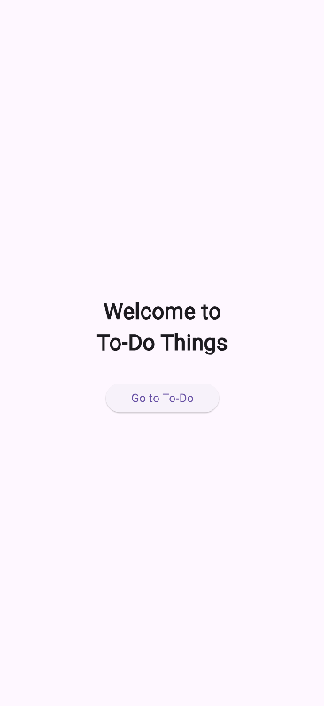
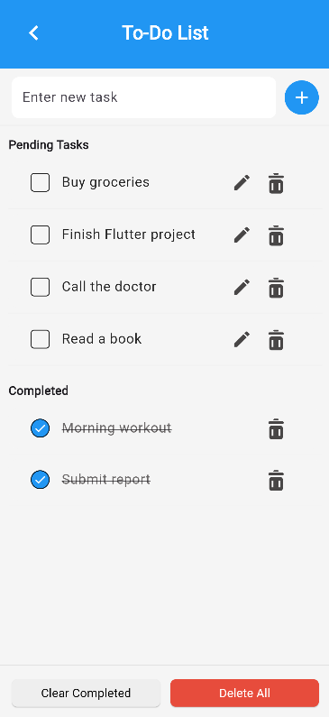

# 📝 To-Do Flutter App

A simple and clean To-Do application built using Flutter.

## ✨ Features
- Add, edit, delete tasks
- Mark tasks as completed
- Persistent storage using SharedPreferences
- Clean and minimal UI

## 📱 Screenshots

### Welcome Screen


### To-Do Screen


## 🚀 Tech Stack
- Flutter
- Dart
- SharedPreferences

## 📦 Installation

```bash
git clone https://github.com/your-username/your-repo-name.git
cd your-repo-name
flutter pub get
flutter run

---